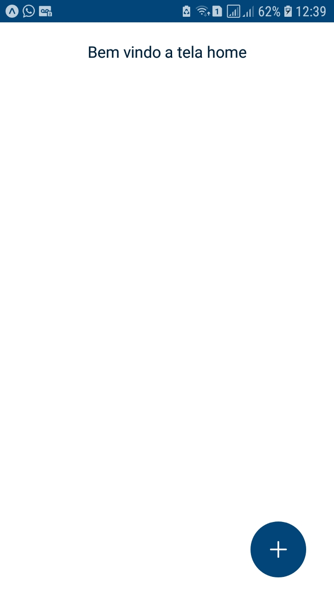
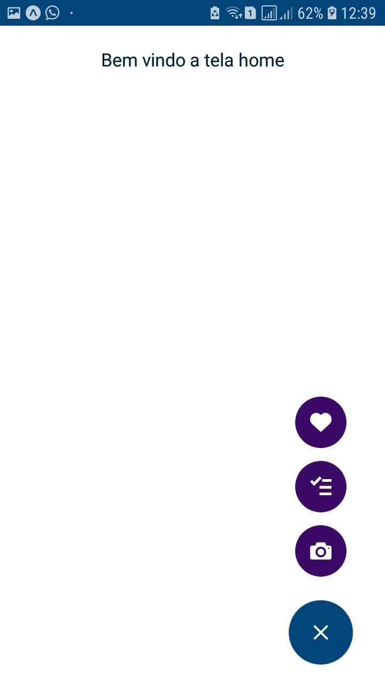
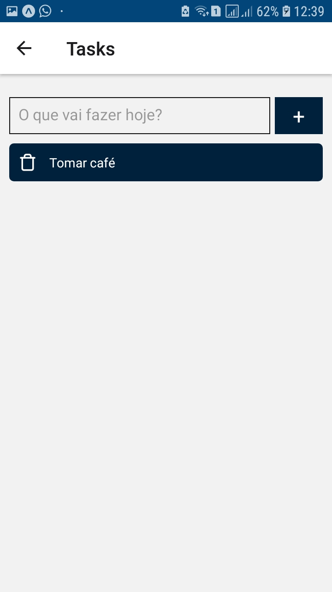
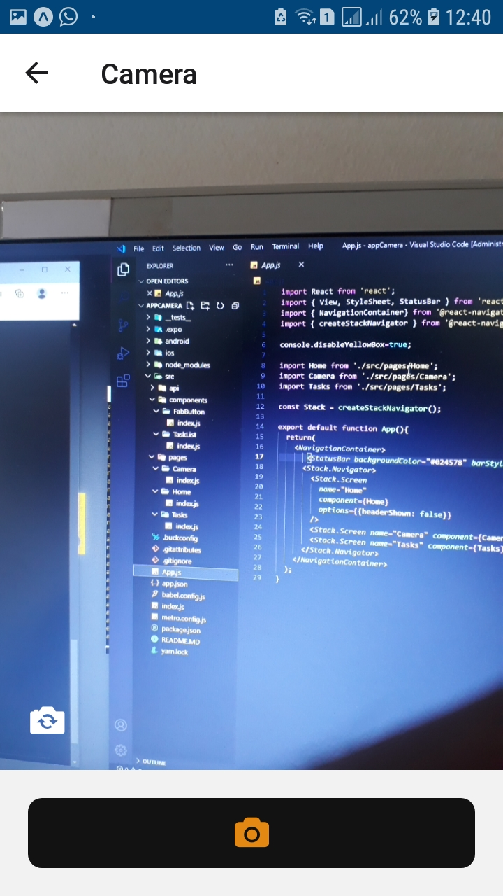

# Manipulando Câmera

## ✅ Descrição do Projeto

 Esta pequena aplicação, tem como objetivo a aplicação de conhecimentos em relação a manipulação de Câmera no React Native e criação de um um Fab Button.

 Adcionei também um TodoList ultilizando o Realtime Database do Firebase, que havia constrido há umas semanas atrás, o adcionei nessa aplicação, para a mesma ter mais opções de navegações.

## 🎁 Demonstração de como ficou o aplicativo
<h1 align="center">
  
  
  
  
  
</h1>

## 🎲 Pré-requisitos e como rodar a aplicação

⚠️ Observção Importante: Caso clone este projeto, modifique as credenciais do "firebaseConnection.js" que está dentro da pasta "api", pois as mesmas estão como credencias de testes no meu banco de dados no Firebase. Adcione as credeciais de seu banco de dados do firebase para poder salvar as suas tarefas.

Os passos a seguir são para rodar a aplicação pelo [Expo](https://expo.io/).

### Pré-requisitos

Antes de começar, você vai precisar ter instalado em sua máquina as seguintes ferramentas:
[Git](https://git-scm.com), [Node.js](https://nodejs.org/en/) e um editor de código, recomendo o [VSCode](https://code.visualstudio.com/).

Baixe também o aplicativo [Expo Go](https://expo.io/client) em seu celular, pois é por ele que você poderá ver o aplicativo rodando.

### Rodando e executando a aplicação 
#### - Clone este repositório
- git clone <https://github.com/WillianMedeiros14/FabButon_Camera.git>

#### - Acesse a pasta do projeto no terminal/cmd
- cd FabButon_Camera

#### -  Instale as dependências, com npm ou yarn
- npm install 
- yarn install

### Rodando o projeto
- expo start

Após isso, aguarde abrir uma janela no seu navegador. Aguarde aparecer um qrcode no canto inferior esquerdo.

### Visualizando o aplicativo e rodando em seu celular
- Quando o qrcode aparecer na aba que abriu em seu navegador, abra o aplicativo Expo Go em seu celular e escaneie o qrcode.
- Aguarde a porcentagem chegar a 100% e o aplicativo abrirá em seu celular.

## 🤳🏾 Como ultilizar e informações do aplicativo

- Após abrir o aplicativo irá abrir a tela home, com apenas uma frase "Bem vindo a tela home" e um botão no canto inferior direiro.
- Ao clicar no botão as opções irão aparecer, que é opção de Câmera, um TodoList e uma opção de curtida.
- Clique sobre as opções e sera navegado até a respectiva página.

## 🛠 Tecnologias

As seguintes ferramentas foram ultilizada na construção do projeto:

- [Expo](https://expo.io/)
- [React Native](https://reactnative.dev/)
- [Firebase](https://firebase.google.com/)
- [React Navigation](https://reactnavigation.org/)